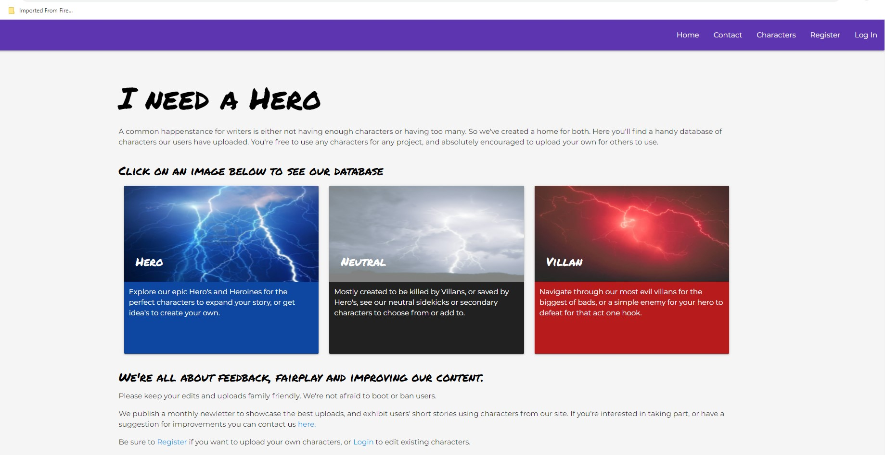
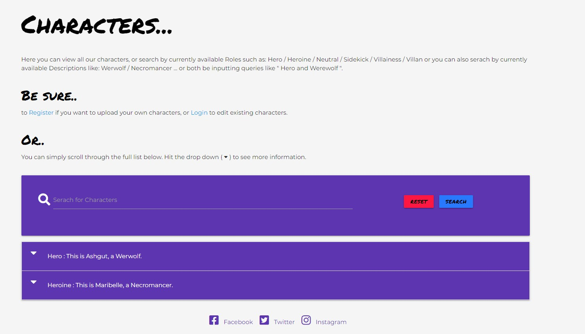
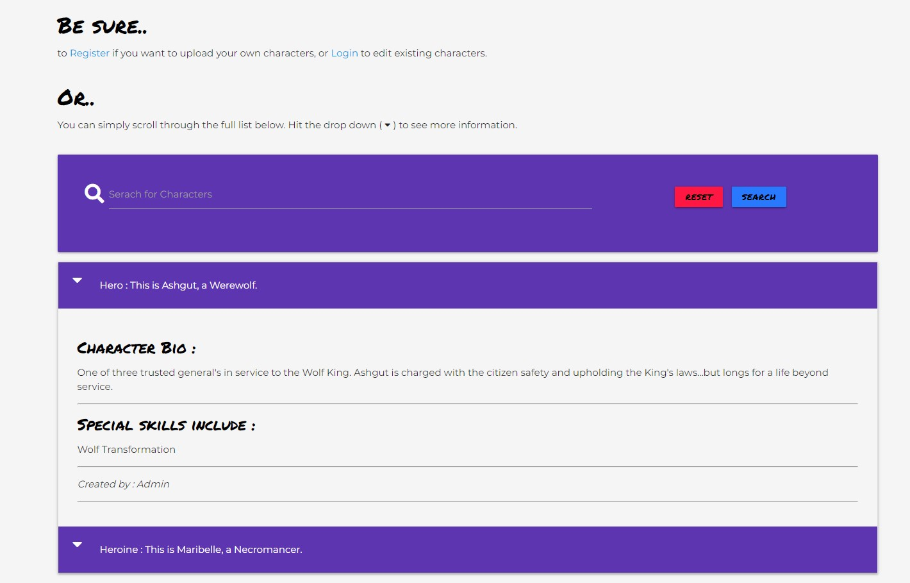

# Project Name: I Need A Hero

## Project aim
The site's aim is to provide a place for users to share characters 
they no longer need, or to find character ideas from those uploaded from other users.
The site targets fantasy writers firstly but the character lists can be utilised by role-players
or anyone with an idea they like to share.

Firstly the site to benefit the user community, and secondly to grow a user database and run competitions
via the monthly newletter with user-submitted short-stories and awards for best uploads.

## UX
#### Strategy & Scope planes
The website targets writers in need of or, in posession of: 
* New character idea's
* Uneeded characters they don;t wnat to waste
* General reserach to see if their idea is already out there.

In terms of scope the site is kept concise and utilises the same colours throughout for a smooth
tranistion from page to page.
* #8e24aa (Deep Purple) - Nav and footer.
* #00e676 (Green), #ff1744 (Red), #2979ff (Blue), #ffea00 (Yellow) for buttons.
* Standard whitesmoke for body background.
* font-family:'Montserrat' for body font, and font-family:'Permanent Marker' for headers.
Both from [Google Fonts](https://fonts.google.com).

## User Experiances
* [New User](#new-user)
* [Returning / Registered User](#returning-user)
* [Administrator](#Administrator)

## New User
New users arrive at the home/index page wto a brief description of the site's intentions.
They are advised to keep uploads family friendly and provided links to view site's characters.

A New User can:
* see only certain navbar links (home, contact, characters, register or [log in](readme/screenshots/login.jpg)).
* choose to [register](readme/screenshots/register.jpg) from the home page.
* choose to [contact](readme/screenshots/contact.jpg) the site from the home page.
* click on any of the three card images which all navigate to the characters page
 where the 
serach functionality is explained and accompanied by a list of current, and self-updating, 
active serach terms. In addition to the search function New Users can scroll through the
existing list of characters and further advised to utilise the dropdown carret for more
information. 

## Returning / Registered User

## Administrator
