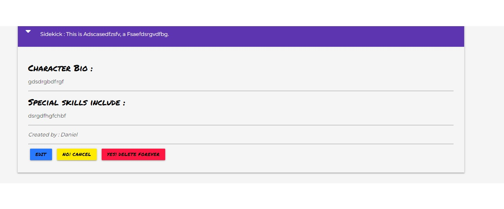

# Project Name: I Need A Hero

## Project aim
The site's aim is to provide a place for users to share characters 
they no longer need, or to find character ideas from those uploaded from other users.
The site targets fantasy writers firstly but the character lists can be utilised by role-players
or anyone with an idea they like to share.

Firstly the site to benefit the user community, and secondly to grow a user database and run competitions
via the monthly newletter with user-submitted short-stories and awards for best uploads.

## UX
#### Strategy & Scope planes
The website targets writers in need of or, in posession of: 
* New character idea's
* Uneeded characters they don;t wnat to waste
* General reserach to see if their idea is already out there.

In terms of scope the site is kept concise and utilises the same colours throughout for a smooth
tranistion from page to page.
* #8e24aa (Deep Purple) - Nav and footer.
* #00e676 (Green), #ff1744 (Red), #2979ff (Blue), #ffea00 (Yellow) for buttons.
* Standard whitesmoke for body background.
* font-family:'Montserrat' for body font, and font-family:'Permanent Marker' for headers.
Both from [Google Fonts](https://fonts.google.com).

## User Experiances
* [New User](#new-user)
* [Returning / Registered User](#returning-user)
* [Administrator](#Administrator)

## New User
### Question: 
"I need a character idea for a story I'm working on." 

### Answer: 
New users arrive at the home/index page to a brief description of the site's intentions.
They are advised to keep uploads family friendly and provided links to view site's characters.

A New User can:
* see only certain navbar links (home, contact, characters, register or [log in](readme/screenshots/login.jpg)).
* choose to [register](readme/screenshots/register.jpg) from the home page.
* choose to [contact](readme/screenshots/contact.jpg) the site from the home page.
* click on any of the three card images which all navigate to the characters page
 where they are advised to 
register if they'd like to upload a character, and if not the  
search functionality is explained and accompanied by a list of current, and self-updating, 
active serach terms. In addition to the search function New Users can scroll through the
existing list of characters and further advised to utilise the dropdown carret for more
information. 

## Returning / Registered User
### Question: 
"I have a character I've' previously shared, but now I want to edit them" 

### Answer: 
A returning / registered user arrives at the home/index page where they can navigate to [log in](readme/screenshots/login.jpg)).
Upon successful login, they are brought to their own profile page which displays only the characters they have created.
 (Note:registered user have access to more nav bar options such as
"Profile" and "Create" ). On their profile page they also have access to edit or delete only charcaters THEY have created. 
. Upon selecting 'edit' they are presented with
the selcted characters information displayed on a new 'Edit character from profile' page [edit_profile](readme/screenshots/registered-user-profile-edit.jpg).
Once the character information has been updated the user is returned to their profile page and flash message confirms their changes.

## Administrator
### Question: 
"I need to delete an inappropriate/nonsensical upload" 

### Answer: 
Upon login the admin is brought to their profile page but can navigate to the characters page to find the offending enrty. Once located, 
via serach function, or scrolling, the admin can expand any uploaded character to find options for 'edit' or 'delete'.

After selecting 'delete' a customized modal appears warning the admin that all deleteions are permenant. When the admin confirms their
understanding and  closes the modal two new buttons appear. "No! Cancel" giving the admin a second chance to rethink their decision, and
"Yes! Delete Forever" which will permenatly remove the upload from the site.
 Upon permenant deletion the admin's choice is confirmed 
via flash message displayed at the top of the screen. 

### Wireframes
#### The Structure & Skeleton planes

ADD IN WIREFRAMES

## Features
### The Surface Plane
Overall the site is responsive and scales with user screen size.

### Existing Features
* Header : Navigation collapses depending on screen size, while also adding/removing options depending on users are logged in or not.
* Index : Is kept concise by design, offers options registration, contact and login in the body. Media queries
and jquery adjust the display cards
accordingly as screen size changes.  
* Contact : A simple form with an area for messages from users. It is not intended for any other purpose.
* Characters: Contains an active list of queriable terms for the serach function. Also houses a complete list of all uploaded 
characters.
* Roles: Available only to ADMIN, the roles pages allows full C.R.U.D. functionality for the admin. Also provides defensive 
programming against duplicate role creations.
* Profile: Allows creation for registered users and ADMIN, as well as displaying characters uploaded by only that user. 
Edit and Delete functions also accessible 
* Create: Available to registered users and ADMIN only, allows creation of new characters which are added to the main characters page
and the users' profile page.
* Log in: verifies username with stored password before granting access.
* Register: checks current user list against entry to deny duplicate user names.
* Log out: Returns user to login page with reduced navbar options, treating them as brand new users. 
* Footer : Links provided to fictional social medias.
* Other: Modals and hide/show functions to interupt accidental deletions.

### Features left to implement 
* Link contact form using python. When email.js was applied and functional, it interfered with the flash messages on submit.

## Technologies used
* HTML-For basic structure.
* CSS-For styling and required Media Query outside of Bootstrap.
* JavaScriprt 
* [Email.JS](https://www.emailjs.com/)
* [Jquery](https://jquery.com/)
* [W3C validator](https://validator.w3.org/)-Used in testing HTML and CSS.
* [JsHINT](https://jshint.com)-Used for Java Script validation.
* [GitHub](https://github.com) -For deployment.
* [GitPod](https://www.gitpod.io/) -IDE.
* [Bootstrap (including JQuery)](https://getbootstrap.com) -Utilized for responsiveness via columns, buttons and navbars.
* [Google Fonts](https://fonts.google.com) -Used for primary font employed throughout. [Lato]('https://fonts.googleapis.com/css2?family=Lato&display=swap').
* [Visual Studio](https://code.visualstudio.com) -For offline work.
* [Font Awesome](https://fontawesome.com/)  - For icons.
* Google Chrome's Responsive Viewer found [here](https://chrome.google.com/webstore/detail/responsive-viewer/inmopeiepgfljkpkidclfgbgbmfcennb)
* Google Chrome's lighthouse function.
* [Jinja](https://jinja.palletsprojects.com/en/3.0.x/)
* [Pthon3]](https://www.python.org/)
* [Werkzeug](https://werkzeug.palletsprojects.com/en/2.0.x/)
* [MongoDB](https://www.mongodb.com/)
* [Heroku](https://www.heroku.com/)
* Others such as FLASK can be found in the app.py and requirements folders.

# Testing
Click [here](Testing.md) for full testing
## Responsiveness 
## Lighthouse

# Code Validation
## jshint and others 

# Deployment 

# Credits   
## contents 
## Media