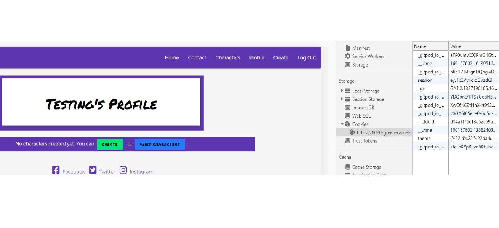

# Testing : I Need A Hero 

## Users

### Registration
User (Testing) can register via register.html using 'password' as their password. They are redirected to profile.html

The registered user is added to db 
Once logged in the registered user -who is not admin- has access to 'Characters', 'Profile', and 'Create' in the navbar 
while 'log in' and 'register' have been removed. The 'session' is also active.

### Profile page
* A button/link labelled 'view charcaters' is available on Testing's profile page to navigate user to (info.html/Characters)

* A button/link labelled 'create' is available on Testing's profile page to navigate user to create_from_profile.html
as noted in the url address. This allows the user to be redirected back to their profile page after character creation, whereas
creating a character form the create.html, or from info.htm/Characters page both send users back to info.html/Characters. 

* The role category is access via select options and the input elements are validated with min and max lenght where applicable.
* The cancel button redirects user to their profile.

* The create button redirects user to their profile with a flash message as confirmation and their newly created character showing.
It also provides options to 'Edit' or 'Delete' existing characters. A new 'create' button is placed at the top of their list for easy access.

* Choosing to Edit a Character brings the user to edit_from_profile.html so they can be sent back to their profile upon completion

### Characters page
* Here a self updating list of serachable terms is provided : roles(hero/heroine) or descriptions (Werewolf/Necromancer). 
Only the Admin can update Character Roles, though users are free to add descriptions of their choice to newly created characters. 
* There is also a serach function where users can utilise the list provided to search by role or description or both.

* serach results display all matches to 'hero' and 'werewolf'

### logout

